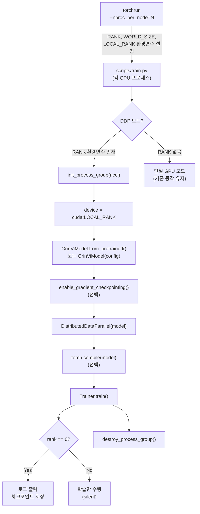

# Design Document: Multi-GPU Training (DDP)

## Overview

GrinVi 학습 파이프라인에 `torch.nn.parallel.DistributedDataParallel(DDP)` 기반 멀티 GPU 지원을 추가한다.
진입점은 `torchrun`이며, 기존 `python scripts/train.py` 단일 GPU 경로는 코드 변경 없이 그대로 동작한다.

### 목표

- `torchrun --nproc_per_node=N scripts/train.py` 명령 하나로 N개 GPU 병렬 학습 시작
- 유효 배치 크기 = `batch_size × world_size × gradient_accumulation_steps` 로 처리량 선형 향상
- 체크포인트·로그는 rank 0 프로세스에서만 기록하여 충돌 방지
- 기존 단일 GPU 코드 경로를 최대한 보존하여 회귀(regression) 위험 최소화

### 비목표

- FSDP(Fully Sharded Data Parallel) 또는 Tensor Parallelism 지원
- 멀티 노드(multi-node) 분산 학습
- 체크포인트에 optimizer/scaler 상태 저장

---

## Architecture

### 전체 흐름



### DDP 초기화 순서 (Trainer.__init__)

```
1. detect_ddp()          → RANK 환경변수로 DDP 여부 판단
2. init_process_group()  → backend="nccl"
3. model.to(device)      → cuda:LOCAL_RANK
4. enable_gradient_checkpointing()  (선택, DDP 래핑 전)
5. DistributedDataParallel(model)   (DDP 래핑)
6. torch.compile(model)             (선택, DDP 래핑 후)
7. AdamW optimizer 생성
8. LR 스케일링 적용
```

---

## Components and Interfaces

### 1. `TrainerConfig` 변경사항

`grinvi/trainer.py`의 `TrainerConfig`에 두 필드를 추가한다.

```python
class TrainerConfig:
    def __init__(
        self,
        ...
        world_size: int = 1,          # DDP: WORLD_SIZE 환경변수 값, 단일 GPU: 1
        scale_lr: str = "none",       # "linear" | "sqrt" | "none"
    ):
```

| 필드 | 타입 | 기본값 | 설명 |
|------|------|--------|------|
| `world_size` | `int` | `1` | 전체 GPU 수. DDP 모드에서는 `int(os.environ["WORLD_SIZE"])` |
| `scale_lr` | `str` | `"none"` | LR 스케일링 방식. `"linear"`, `"sqrt"`, `"none"` |

### 2. `Trainer` 변경사항

#### 2.1 DDP 감지 및 초기화

```python
def _setup_distributed(self) -> tuple[bool, int, int]:
    """
    Returns: (is_ddp, rank, local_rank)
    RANK 환경변수 존재 여부로 DDP 모드를 자동 감지한다.
    """
    if "RANK" not in os.environ:
        return False, 0, 0
    dist.init_process_group(backend="nccl")
    rank = dist.get_rank()
    local_rank = int(os.environ["LOCAL_RANK"])
    return True, rank, local_rank
```

#### 2.2 모델 래핑 순서

```python
# 1. gradient checkpointing (DDP 래핑 전)
if cfg.gradient_checkpointing:
    model.enable_gradient_checkpointing()

# 2. DDP 래핑
if is_ddp:
    model = DDP(model, device_ids=[local_rank])

# 3. torch.compile (DDP 래핑 후)
if cfg.compile_model:
    model = torch.compile(model)
```

#### 2.3 LR 스케일링

```python
def _compute_effective_lr(base_lr: float, world_size: int, scale_lr: str) -> float:
    if scale_lr == "linear":
        return base_lr * world_size
    elif scale_lr == "sqrt":
        return base_lr * math.sqrt(world_size)
    else:  # "none"
        return base_lr
```

#### 2.4 `no_sync()` 최적화

```python
# gradient accumulation 중간 스텝: no_sync()로 통신 억제
is_last_accum = (self.step + 1) % self.cfg.gradient_accumulation_steps == 0
ctx = contextlib.nullcontext() if (not self.is_ddp or is_last_accum) else self.model.no_sync()
with ctx:
    loss = self._forward(batch) / self.cfg.gradient_accumulation_steps
    self.scaler.scale(loss).backward()
```

#### 2.5 eval loss 집계

```python
@torch.no_grad()
def _eval(self, step: int):
    ...
    avg_loss = sum(losses) / len(losses)
    loss_tensor = torch.tensor(avg_loss, device=self.device)
    if self.is_ddp:
        dist.all_reduce(loss_tensor, op=dist.ReduceOp.AVG)
    avg_loss = loss_tensor.item()
    if self.rank == 0:
        console.print(...)
```

#### 2.6 체크포인트 저장

```python
def _get_raw_model(self) -> GrinViModel:
    """DDP 래퍼를 제거하고 원본 GrinViModel을 반환한다."""
    return self.model.module if self.is_ddp else self.model

def _save(self, tag):
    if self.rank != 0:
        return
    self._get_raw_model().save_pretrained(str(out))
    ...
    if self.is_ddp:
        dist.barrier()  # 저장 완료 후 모든 rank 동기화
```

#### 2.7 에러 처리 및 정리

```python
def train(self):
    try:
        self._train_loop()
    except RuntimeError as e:
        if self.rank == 0:
            console.print(f"[red]RuntimeError: {e}[/red]")
        raise
    finally:
        if self.is_ddp:
            dist.destroy_process_group()
```

### 3. `scripts/train.py` 변경사항

#### 3.1 DDP 감지 및 device 결정

```python
is_ddp = "RANK" in os.environ
if is_ddp:
    local_rank = int(os.environ["LOCAL_RANK"])
    world_size = int(os.environ["WORLD_SIZE"])
    device = f"cuda:{local_rank}"
else:
    world_size = 1
    device = args.device or ("cuda" if torch.cuda.is_available() else "cpu")
```

#### 3.2 DataLoader 생성

```python
if is_ddp:
    train_sampler = DistributedSampler(train_ds, shuffle=True)
    train_loader = DataLoader(train_ds, batch_size=args.batch_size,
                              sampler=train_sampler, shuffle=False,  # sampler와 shuffle 동시 사용 불가
                              collate_fn=collate_fn, num_workers=4,
                              pin_memory=True, persistent_workers=True, drop_last=True)
else:
    train_loader = DataLoader(train_ds, batch_size=args.batch_size,
                              shuffle=True, ...)  # 기존 동작 유지
```

#### 3.3 TrainerConfig 생성

```python
tcfg = TrainerConfig(
    ...
    world_size=world_size,
    scale_lr=args.scale_lr,  # 새 CLI 인수
)
```

#### 3.4 새 CLI 인수

```
--scale_lr    {linear,sqrt,none}   LR 스케일링 방식 (기본값: none)
```

---

## Data Models

### `TrainerConfig` (확장 후)

```python
@dataclass-like
TrainerConfig:
    # 기존 필드 (변경 없음)
    max_steps: int
    batch_size: int
    gradient_accumulation_steps: int
    learning_rate: float
    weight_decay: float
    max_grad_norm: float
    warmup_steps: int
    eval_interval: int
    save_interval: int
    checkpoint_dir: Path
    device: str
    dtype: str                    # "float32" | "float16" | "bfloat16"
    compile_model: bool
    gradient_checkpointing: bool
    log_interval: int
    keep_last_n: int

    # 신규 필드
    world_size: int = 1           # DDP: WORLD_SIZE, 단일 GPU: 1
    scale_lr: str = "none"        # "linear" | "sqrt" | "none"
```

### `Trainer` 내부 상태 (확장 후)

```python
Trainer:
    cfg: TrainerConfig
    device: str                   # "cuda:N" (DDP) 또는 "cuda"/"cpu" (단일)
    is_ddp: bool                  # DDP 모드 여부
    rank: int                     # 0 (단일 GPU) 또는 dist.get_rank()
    local_rank: int               # 0 (단일 GPU) 또는 LOCAL_RANK
    model: DDP | GrinViModel      # DDP 래핑 여부에 따라 다름
    scaler: GradScaler            # float16 전용, bfloat16에서는 enabled=False
    optimizer: AdamW
    scheduler: LambdaLR
    train_loader: DataLoader
    eval_loader: DataLoader | None
    step: int
    best_eval_loss: float
```

### DDP 환경 변수 매핑

| 환경 변수 | 의미 | 사용처 |
|-----------|------|--------|
| `RANK` | 전역 프로세스 순위 (0 ~ world_size-1) | DDP 감지, 로그/저장 조건 |
| `WORLD_SIZE` | 전체 프로세스 수 | `TrainerConfig.world_size` |
| `LOCAL_RANK` | 노드 내 GPU 인덱스 | `device = cuda:LOCAL_RANK` |

---

## Correctness Properties

*A property is a characteristic or behavior that should hold true across all valid executions of a system — essentially, a formal statement about what the system should do. Properties serve as the bridge between human-readable specifications and machine-verifiable correctness guarantees.*

### Property 1: LR 스케일링 수식 정확성 및 불변성

*For any* base learning rate `lr > 0`, world size `N ≥ 1`, and scale mode `m ∈ {"linear", "sqrt", "none"}`, `_compute_effective_lr(lr, N, m)`의 반환값은 다음을 만족해야 한다:
- `"linear"` → `lr * N`
- `"sqrt"` → `lr * sqrt(N)`
- `"none"` → `lr` (변경 없음)

또한 `N = 1`일 때는 모드에 관계없이 항상 `lr`을 반환해야 한다 (단일 GPU 불변성).

**Validates: Requirements 4.3, 4.4, 4.5**

---

### Property 2: global_batch_size 계산 정확성

*For any* `batch_size ≥ 1`, `world_size ≥ 1`, `gradient_accumulation_steps ≥ 1` 값의 조합에 대해, `global_batch_size = batch_size × world_size × gradient_accumulation_steps` 공식이 항상 성립해야 하며, `global_batch_size ≥ batch_size`가 보장되어야 한다.

**Validates: Requirements 4.6**

---

### Property 3: _get_raw_model 정확성

*For any* Trainer 인스턴스에 대해, `is_ddp=True`이면 `_get_raw_model()`은 `model.module`을 반환하고, `is_ddp=False`이면 `model` 자체를 반환해야 한다. 반환된 객체는 항상 `GrinViModel` 인스턴스여야 한다.

**Validates: Requirements 2.2, 5.2, 5.3**

---

### Property 4: 체크포인트 저장 후 로드 동등성 (round-trip)

*For any* `GrinViModel` 인스턴스(임의의 설정, `tie_word_embeddings` 여부 포함)에 대해, `save_pretrained(path)` 후 `from_pretrained(path)`로 로드한 모델의 모든 파라미터 텐서가 원본과 수치적으로 동일해야 한다. DDP 래핑 여부(`model.module.save_pretrained` vs `model.save_pretrained`)와 무관하게 이 성질이 보장되어야 한다.

**Validates: Requirements 5.2, 5.3, 8.3**

---

## Error Handling

### DDP 초기화 실패

```python
try:
    dist.init_process_group(backend="nccl")
except Exception as e:
    print(f"[ERROR] DDP init failed: {e}", file=sys.stderr)
    sys.exit(1)
```

`NCCL_DEBUG=INFO` 환경변수를 설정하면 상세 오류 로그를 확인할 수 있다.

### RuntimeError (CUDA OOM 등)

```python
try:
    self._train_loop()
except RuntimeError as e:
    if self.rank == 0:
        console.print(f"[red]✗ RuntimeError: {e}[/red]")
    raise  # 상위로 전파하여 finally 블록에서 cleanup 보장
finally:
    if self.is_ddp:
        dist.destroy_process_group()
```

- `consecutive_errors` 카운터 제거: 에러 발생 즉시 안전 종료
- `destroy_process_group()`은 `finally` 블록에서 항상 호출 보장
- 타임아웃 처리: `dist.init_process_group(..., timeout=datetime.timedelta(seconds=1800))`

### NaN/Inf 손실

DDP 모드에서도 기존 NaN/Inf 감지 로직을 유지한다. 단, 에러 발생 시 `consecutive_errors` 카운터 없이 즉시 종료한다.

### 체크포인트 저장 실패

rank 0에서 저장 실패 시 `console.print`로 경고를 출력하고 학습을 계속한다. `dist.barrier()`는 저장 성공 여부와 무관하게 호출하여 다른 rank가 무한 대기하지 않도록 한다.

---

## Testing Strategy

### 단위 테스트 (Unit Tests)

`pytest` 기반. DDP 실제 초기화 없이 로직을 검증한다.

| 테스트 | 검증 내용 |
|--------|-----------|
| `test_lr_scaling_linear` | `scale_lr="linear"` 시 `lr * world_size` 반환 |
| `test_lr_scaling_sqrt` | `scale_lr="sqrt"` 시 `lr * sqrt(world_size)` 반환 |
| `test_lr_scaling_none` | `scale_lr="none"` 시 `lr` 그대로 반환 |
| `test_lr_scaling_world_size_1` | 모든 모드에서 `world_size=1`이면 `lr` 불변 |
| `test_global_batch_size` | `batch_size × world_size × grad_accum` 공식 검증 |
| `test_get_raw_model_ddp` | `is_ddp=True`일 때 `_get_raw_model()`이 `model.module` 반환 |
| `test_get_raw_model_single` | `is_ddp=False`일 때 `_get_raw_model()`이 `model` 반환 |
| `test_checkpoint_roundtrip` | `save_pretrained` → `from_pretrained` 파라미터 동등성 |
| `test_trainer_config_defaults` | `world_size=1`, `scale_lr="none"` 기본값 확인 |

### 속성 기반 테스트 (Property-Based Tests)

`hypothesis` 라이브러리 사용. 각 테스트는 최소 100회 이상 실행한다.

```python
# 설치
pip install hypothesis
```

#### Property 1: LR 스케일링 수식 정확성 및 불변성

```python
# Feature: multi-gpu-training, Property 1: LR scaling formula correctness and world_size=1 invariance
@given(
    lr=st.floats(min_value=1e-8, max_value=1.0, allow_nan=False, allow_infinity=False),
    world_size=st.integers(min_value=1, max_value=64),
    mode=st.sampled_from(["linear", "sqrt", "none"]),
)
@settings(max_examples=200)
def test_lr_scaling_properties(lr, world_size, mode):
    result = _compute_effective_lr(lr, world_size, mode)
    if mode == "linear":
        assert math.isclose(result, lr * world_size, rel_tol=1e-6)
    elif mode == "sqrt":
        assert math.isclose(result, lr * math.sqrt(world_size), rel_tol=1e-6)
    else:  # "none"
        assert math.isclose(result, lr, rel_tol=1e-6)
    # world_size=1 불변성: 모든 모드에서 lr 그대로
    if world_size == 1:
        assert math.isclose(result, lr, rel_tol=1e-6)
```

#### Property 2: global_batch_size 계산 정확성

```python
# Feature: multi-gpu-training, Property 2: global_batch_size formula
@given(
    batch_size=st.integers(min_value=1, max_value=256),
    world_size=st.integers(min_value=1, max_value=16),
    grad_accum=st.integers(min_value=1, max_value=32),
)
@settings(max_examples=200)
def test_global_batch_size_property(batch_size, world_size, grad_accum):
    global_bs = batch_size * world_size * grad_accum
    assert global_bs == batch_size * world_size * grad_accum
    assert global_bs >= batch_size  # 단조 증가 보장
```

#### Property 3: _get_raw_model 정확성

```python
# Feature: multi-gpu-training, Property 3: _get_raw_model returns correct object
@given(is_ddp=st.booleans())
@settings(max_examples=100)
def test_get_raw_model_property(is_ddp):
    config = GrinViConfig.tiny()
    raw_model = GrinViModel(config)
    if is_ddp:
        # DDP 래퍼를 모방하는 간단한 wrapper
        class FakeDDP:
            def __init__(self, m): self.module = m
        model = FakeDDP(raw_model)
    else:
        model = raw_model
    result = _get_raw_model(model, is_ddp)
    assert isinstance(result, GrinViModel)
    assert result is raw_model  # 항상 원본 GrinViModel 반환
```

#### Property 4: 체크포인트 round-trip

```python
# Feature: multi-gpu-training, Property 4: checkpoint save/load round-trip
@given(
    tie_embeddings=st.booleans(),
)
@settings(max_examples=20)  # 모델 생성 비용으로 20회로 제한
def test_checkpoint_roundtrip_property(tmp_path, tie_embeddings):
    config = GrinViConfig.tiny()
    config.tie_word_embeddings = tie_embeddings
    model = GrinViModel(config)
    model.save_pretrained(str(tmp_path))
    loaded = GrinViModel.from_pretrained(str(tmp_path))
    for (n1, p1), (n2, p2) in zip(model.named_parameters(), loaded.named_parameters()):
        assert n1 == n2
        assert torch.allclose(p1, p2)
```

### 통합 테스트 (Integration Tests)

실제 `torchrun`을 사용하는 E2E 테스트. CI 환경에서는 GPU 2개 이상 필요.

```bash
# 2-GPU DDP 스모크 테스트
torchrun --nproc_per_node=2 scripts/train.py \
    --preset tiny --max_steps 10 --batch_size 2 --grad_accum 1

# 단일 GPU 회귀 테스트 (기존 동작 유지 확인)
python scripts/train.py \
    --preset tiny --max_steps 10 --batch_size 2 --grad_accum 1
```

### 테스트 실행

```bash
# 단위 + 속성 기반 테스트
pytest tests/test_multi_gpu_training.py -v

# 속성 기반 테스트만 (verbose)
pytest tests/test_multi_gpu_training.py -v -k "property"
```
